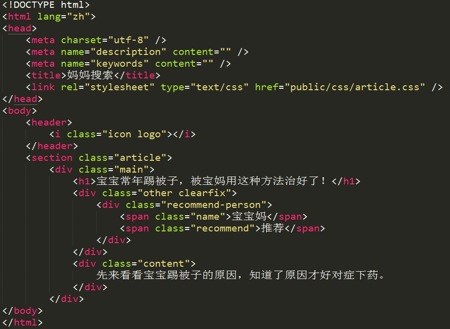
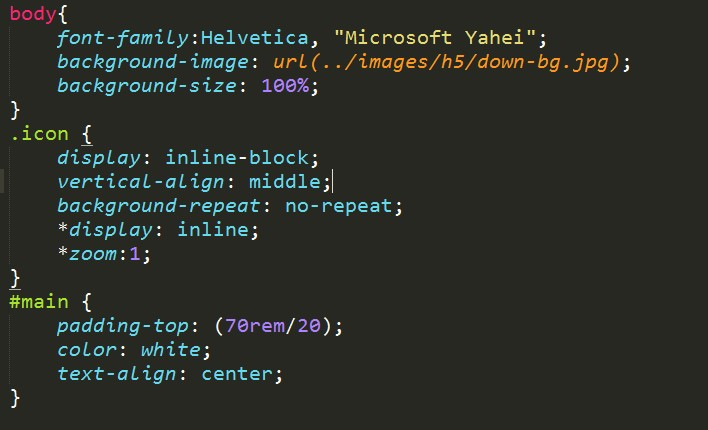

# Web系统概论培训记录（3）

## HTML与CSS入门（2015.10.29）

记录人：杨楠

### 作业检查情况

1. 完成较好的同学：[王远涵](https://github.com/ITEC-ELWG/FE-Study/blob/master/wangyuanhan/base.md)、[江心人](https://github.com/ITEC-ELWG/FE-Study/blob/master/jiangxinren/base.md)、[杨楠](https://github.com/ITEC-ELWG/FE-Study/blob/master/yangnan/base.md)。
2.  Markdown语法易错点：

    + 段落前后要有一个以上的空行。
    + 列表项目间不空行。
    + 列表项目标记后要接至少一个空格。
3.  编码相关：

    + 缩进4格时用Tab或空格，两种方式二选一，保证编码风格一致。
    + 在编辑器中设置Tab为4个空格。如：Sublime Text中，选择View-Indentation菜单，勾选Tab Width:4。
    + 将文件保存为UTF-8编码，避免在浏览器中显示时出现乱码。如：Sublime Text中，默认保存为UTF-8编码，可在File-Save with encoding菜单中选择文件的编码格式。
4. 提交（commit）时，写好本次修改的注释。小技巧：使用git commit -m "xxx(commit message)"，可直接在命令行输入commit message，而不用打开编辑器。
5. 会议记录要尽量详实。

___

**下面仅对[课程PPT](HTML&CSS.pptx)上的内容补充说明**

### HTML

说明：

1. [<!DOCTYPE html>](http://www.w3school.com.cn/html/html_doctype.asp) ：声明该HTML文档是用HTML 5编写的。
2.	图中，&lt;head>内的元素有：[&lt;meta>](http://www.w3school.com.cn/html5/html5_meta.asp)、[&lt;title>](http://www.w3school.com.cn/html/html_head.asp)、[&lt;link>](http://www.w3school.com.cn/html/html_head.asp)。

	&lt;body>内的元素有：&lt;header>、&lt;section>。[&lt;header>](http://www.w3school.com.cn/tags/tag_header.asp)、[&lt;section>](http://www.w3school.com.cn/tags/tag_section.asp)、[&lt;footer>](http://www.w3school.com.cn/tags/tag_footer.asp)是HTML 5中的新标签。

	&lt;section>内还有&lt;div>等元素。

### CSS

1. 插入样式表的3种方法。详见[CSS 创建](http://www.w3school.com.cn/css/css_howto.asp)。
2. 样式优先级。详见[CSS 简介-层叠次序](http://www.w3school.com.cn/css/css_intro.asp)。
3. 常见的CSS选择器：元素选择器(详见[CSS 元素选择器](http://www.w3school.com.cn/css/css_selector_type.asp))、类选择器(详见[CSS 类选择器](http://www.w3school.com.cn/css/css_syntax_class_selector.asp))、id 选择器(详见[CSS id 选择器](http://www.w3school.com.cn/css/css_syntax_id_selector.asp))。
4. 盒模型（**前端面试常问的问题**）。详见[CSS 框模型概述](http://www.w3school.com.cn/css/css_boxmodel.asp)。
5. 定位。除非专门指定，否则元素按在HTML中的位置从上到下一个接一个地排列。[CSS 相对定位](http://www.w3school.com.cn/css/css_positioning_relative.asp)、[CSS 绝对定位](http://www.w3school.com.cn/css/css_positioning_absolute.asp)、[CSS 浮动](http://www.w3school.com.cn/css/css_positioning_floating.asp)。

### 调试-[DevTools](https://developers.google.com/web/tools/chrome-devtools/)

**本次作业只关注Elements面板**

1. 点击“审查元素按钮”（箭头），在页面上选择元素，Elements面板中会显示出对应的HTML片段。
2.	Elements面板右侧：
	
	+ Styles面板中显示应用于所选元素的所有CSS规则。下方有对应的盒模型。
	+ 中划线表示样式被覆盖。
	+ 可在Styles面板中直接编辑、调试。数值型属性值可用上、下箭头微调。
	+ Computed面板中显示计算后的最终样式，只读。
3. Network面板中显示网络请求资源的实时信息。
4. Resources面板显示页面所加载的资源列表，包括cookies、session、缓存等本地存储信息。可以修改、删除。
5. Console面板：控制台，可用于JavaScript调试。
6. 点击“手机图标”进入手机模拟器，可以选择模拟的设备、网络状况等。

### 网页布局

1. 固定布局：网站内容被一个固定宽度的容器包裹，容器内的区块都有固定的百分比或者像素宽度值。常用于PC端。
2. 流动布局：大多数组件（包括主容器）都设成百分比宽度，并且根据用户的屏幕分辨率自适应。常用于手机端。
3. 弹性布局：使用单位em来定义元素宽度。常用于手机端。
4.	网页布局设计难点：兼容性。

	常见的布局，如GitHub采用的居中式、微博采用的两栏式，一般都有对应的解决方案。按固定写法可以解决大部分兼容性问题。但是，同一种样式可以有多种写法，一般多种方法各有优缺点。
	
	兼容性测试包括浏览器兼容性、分辨率兼容性。要求在不同环境下看起来均正常。

	开发中，结合应用场景可以有不同的兼容性需求。如：主要用户为学生时，可以只考虑Chrome、Firefox等浏览器，而主要用户为老人时，可能需要考虑IE6等低版本浏览器的兼容性。

	响应式Web设计：可以智能地根据用户行为以及使用的设备环境（系统平台、屏幕尺寸、屏幕定向等）进行相对应的布局。	

### HTML 5和CSS3

暂时不需要学习，项目中用到时再学。

### 编码规范

1. HTML文档中，用缩进表示标签层级关系。
2. HTML文档中，类（class）、ID属性的值用单引号或双引号包围均可，推荐用双引号。
3. CSS文档中，类选择器名和ID选择器名后有空格。冒号、逗号后有空格。（注意“{”和“}”的位置）。
4. 推荐书《代码整洁之道》。
5. 有适用于Sublime Text的排版插件，可用于完善编码风格。

### 作业

1. 	建议先根据原型图分析DOM树。

	示例1：图1对应DOM树。

	示例2：作业中参考图2对应DOM树。
2.	作业要求：
	
	+ 保证最低程度的兼容性。Windows平台下要兼容Chrome、Firefox浏览器，使用苹果电脑的要兼容Safari浏览器。改变浏览器窗口大小时，要保证分辨率兼容性。
	+ 任务1：缩放浏览器时，内容始终居中。
3. 下次课检查任意给定页面，分析其对应DOM树。
4. 平时可多分析淘宝、微博等页面，多学习。