# Web系统概论培训记录（4）

### —— JS入门指导（2015.11.03）

记录人：王远涵

### 课前 
**由林寿山学长主讲**

主要针对上周布置的两次任务中存在的问题做了讲解， 并在部分细节问题上做出了着重要求， 具体内容如下
#### git commit
- git对于文件的修改划分较细， 因此在提交时只要进行了某些改动， 甚至只是搭建好了框架， 都可以进行一次commit。 **（个人理解）**这样可以使得整个开发流程更为清晰
- 每次commit前应当仔细检查项目中修改的部分， 不要让垃圾文件（如系统自动生成 的代码等）污染整个项目

#### CSS
- id选择器一般是在已确定该选择器在全局中是独一无二的情况下使用， 实际开发中一般不用， 而是选用类选择器
- 选择器的命名应当采用小写字母加中划线 “ - ” 的方式， 且名字应当有意义， 以增强代码的可阅读性
- 注意区分**内联元素**（inline element 一般是基于语义级的基本元素， 只能容纳文本或者其他内联元素）和**块级元素**（block element 一般是其他元素的容器元素， 能容纳其他块元素或内联元素）。 上述两类具体包括哪些元素， 可参考[内联元素及块级元素列表](http://www.w3cwhy.com/css-html/html-hkmarka.html)
- 慎重使用HTML5中的article和section标签
- 尽量不用nbsp来替换空格， 这样会导致代码不美观。 常用的方式是采用CSS控制字间距以实现空格
- 学习前端开发需要具备良好的审美观。  网页设计可参考[优设网](http://www.uisdc.com)。 配色方案可参考[Flat UI Colors](https://flatuicolors.com/)

#### 思考题
margin（外边距）及padding（内边距）分别在什么情况下使用？

### 正题
**由谭旻学姐主讲**

[课程PPT地址](images/JS/JS入门指导.pptx)
#### 简介
JavaScript是一种直译式的**脚本语言**。 具有上手迅速、功能强大、使用率高但拥有大量难懂特性等特点
#### 基础
- JS主要用于前端页面与后台间的交流以及为HTML网页增加动态功能。 另外， JS同样可以用来写后台
- JS的**主机对象**分为**Windows对象**（对应浏览器窗口本身）和**Document对象**（处理网页内容）两类
- **this**可代表任何一种当前元素
- JS代码区分大小写

#### 语法
- **ECMAScript 5**： 核心JS编程语言
- JS编程分为**普通模式**（不常用）和**严格模式**（常用）两种， 二者的区别在于严格模式只需在函数顶部加上use strict即可， 如下
``` javascript
function my() {
          “use strict”;
          //函数其余部分
}
```
- JS的**数据类型**分为如下两类

|类别|类型|内存|
|:-:|:-:|:-:|
|基本类型|Number、String、Boolean、Null、Undefined等|栈内存|
|引用类型|object等|堆内存|

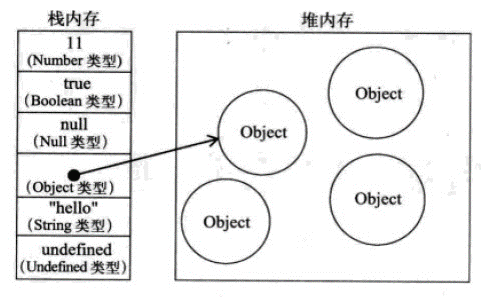
- JS在**复制变量**时， 对于基本类型的值会创建一个新值， 而对于引用类型的值则复制前后的两个变量将指向同一个对象

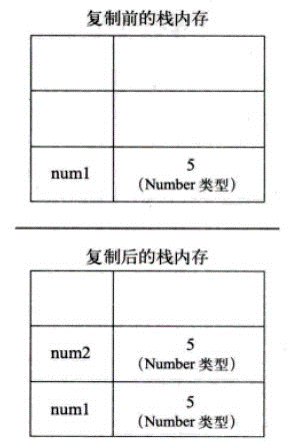
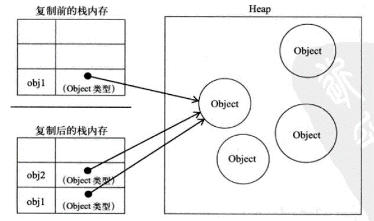

示例程序及相应的运行结果如下
``` javascript
function chainStore() {
	var store1='Nike China';
	var store2=store1;
	store1='Nike U.S.A.';
	console.log(store2);
}

chainStore();
```
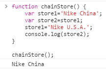
``` javascript
function chainStore() {
	var store1=['Nike China'];
	var store2=store1;
	console.log(store2[0]);
	store1[0]='Nike U.S.A.';
	console.log(store2[0]);
}

chainStore();
```
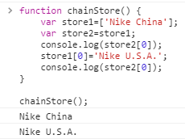

- JS在**传递参数**方面均采用按值传递的方式， 其中引用类型的按值传递如同引用类型变量的复制
- **JS的函数与调用**
	-	函数是**第一类对象**
	-	函数分为**函数表达式**（命名及匿名）以及**函数声明**
	-	除了声明时定义的形参外， 每个函数都会额外接收两个附加参数**this**（值取决于调用模式）和**arguments**（实际参数）
	-	**arguments**是一个类似数组的对象， 拥有**length**属性， 但不具备数组方法， 常用于接收不定数量的参数
	-	调用模式分为以下四类

|调用模式|调用方式|this指向|
|:-:|:-:|:-:|
|方法调用模式|在对象中调用|所属对象|
|函数调用模式|直接调用|全局|
|构造器调用模式|new+函数名调用|要构造的对象|
|apply调用模式|略|略|

- JS的**函数回调**（callback）， 指把函数作为参数传递给另一个函数时， 函数将在另一个函数中被调用， 示例程序及运行结果如下
``` javascript
function a(callback) {      
	console.log("我是parent函数a");   
    console.log("调用回调函数");   
    callback();   
}

function b() {   
    console.log("我是回调函数b");   
}

function c() {   
    console.log("我是回调函数c");   
}

function test() {   
    a(b);   
    a(c);   
}

test();
```
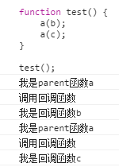
#### 深入理解
- **变量对象**
每个执行环境都有一个与之关联的变量对象， 即执行环境和变量对象一一对应
- **作用域**
不同于C中由花括号{ }界定作用域， JS中直接由函数决定
- **作用链**
**（个人理解）**遵循由内向外寻找、直至全局变量的准则， 示例程序及运行结果如下
``` javascript
var authorName = "山边小溪";

function doSomething() {
    var blogName = "梦想天空";
    
    function innerSay() {
        console.log(blogName);
    }
    
    innerSay();
}

console.log(authorName); 
console.log(blogName); 
doSomething();
innerSay();
```
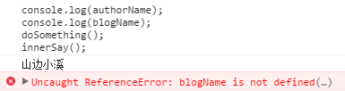

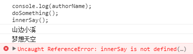
- **原型继承**
每个构造函数都有一个原型对象， 同时都有一个**prototype**属性， **prototype**属性指向构造函数的原型对象， 因此被用来实现基于原型的继承和共享
- **原型链**
原型对象都默认会取得一个**constructor**属性，这个属性包含一个指向构造函数（prototype属性所在函数）的指针， 如下

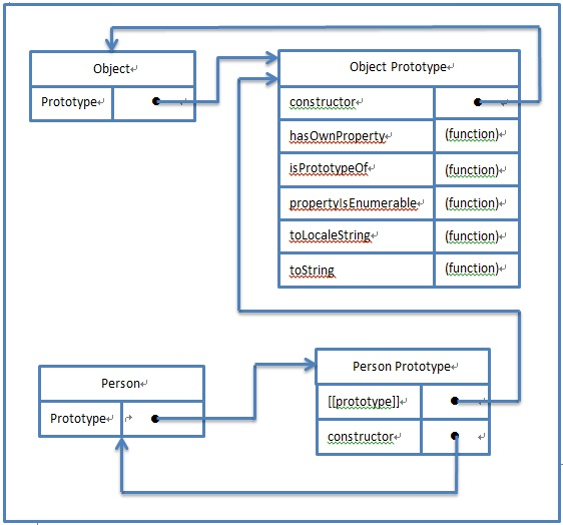

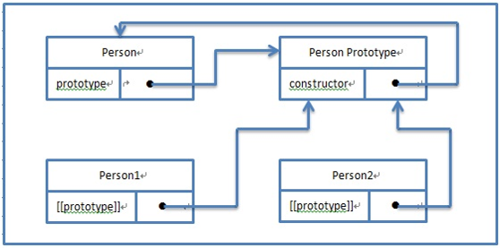

示例程序及运行结果如下
``` javascript
function A(x) {
	this.x=x;
}
 
A.prototype.a = "a";
A.prototype.say = function() {
	console.log("Hi")
}; 

var obj = new A(1);

console.log(obj.x);
console.log(obj.a);
obj.say();
```
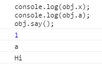
- **变量提升**
无论在程序哪个地方声明变量， 都等同于在函数顶部进行声明， 例如如下第一个程序实际上等同于第二个程序
``` javascript
(function() {
	var a = 'One';
	var b = 'Two';
	var c = 'Three';
})()
```
``` javascript
(function() {
	var a, b, c;
	a = 'One';
	b = 'Two';
	c = 'Three';
})()
```
示例程序及运行结果如下
``` javascript
var v = 'Hello World';

(function() {
	console.log(v);
	var v = 'I love you';
})()
```
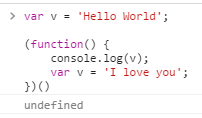
- **函数提升**
当使用函数声明时， 函数定义也被提升； 当使用函数表达式时， 只提升变量， 不提升函数实现。 即在函数声明前可调用该函数， 但在函数表达式前不可调用该函数。 示例程序及运行结果如下
``` javascript
foo(); // local foo  
bar(); // 报错，缺少对象  

// 函数声明  
function foo() {
	console.log("local foo");  
}

//函数表达式  
var bar = function() {
	console.log("local bar");  
};
```
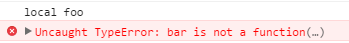
#### 注意事项
- JS容易在不经意间（如定义变量时忘记用var修饰， 或直接使用未经声明的变量等）创造出全局变量， 进而导致全局污染， 因此在代码书写时一定要控制好每个变量的执行环境
- 不同于C等其他语言， JS中用于判断相等的逻辑符号有 “==” 和 “===” 两种， 前者只比较值不比较类型， 而后者既比较值又比较类型
#### 模块化
- **即时函数**
调用一次后就消失， 适用于一次性的任务， 可以避免声明全局变量。 通常有如下两种写法
``` javascript
(function() {
	//模块1的所有代码
}());
```
``` javascript
(function() {
	//模块1的所有代码
})();
```
- **闭包**
由于JS中不存在private、protected等修饰符， 因此要想实现方法和变量的私有化， 可以通过在一个函数内创建另一个函数， 由另一个函数访问这个函数的局部变量的方式。 示例程序及运行结果如下
``` javascript
var girl = (function() {
     var language= 'hi';
     return {
          say : function() {
              return language;
          }
     };
})();

console.log(girl.say());
```
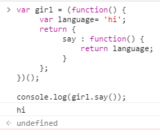
- **模块模式**
模块模式遵循[AMD规范](https://github.com/amdjs/amdjs-api/wiki/AMD)或[CMD规范](https://github.com/seajs/seajs/issues/242)
	1. 建立命名空间和工具模块
	2. 定义该模块
	3. 给公共接口添加方法

#### 优化
- 把script标签放在文档的末尾， /body之前。 这样可以使得整个网页加载完后在去加载JS文件， 不会影响用户的阅读
- 由于一个script标签就会发起一个http请求， 而一个http请求的花费是巨大的。 因此若一个站点用到了多个JS文件， 应该把这些JS文件合并到一个文件中。 这一工作可由Minify（一个开源的PHP项目）等来完成， 实际开发过程中不需要我们对多个JS文件进行合并
- **压缩脚本**
一般保留两个版本， 一个是工作副本（可以修改代码并添加注释）， 一个是精简副本（用于放在站点上， 文件名加 “min” 字样）
- 代码检查工具[JSLint官网](http://www.jslint.com/)（可在线检测JS代码）

### 补充
**由林寿山学长主讲**

- 无论是JS的开发还是调试， 都应当熟练运用Chrome的debug
- 由于allert为弹框输出， 会影响代码的流畅性， 因此调试过程中应当使用console.log进行输出。 **（个人理解）**allert可以用作断点， 可直接在程序指定位置输出感兴趣的变量值
- **代码规范**
4空格缩进， 同时需要注意运算符左右的空格等细节， 可利用排版插件进行自动排版。 [sublime_text常用插件介绍及下载](http://www.cnblogs.com/dudumao/p/4054086.html)
