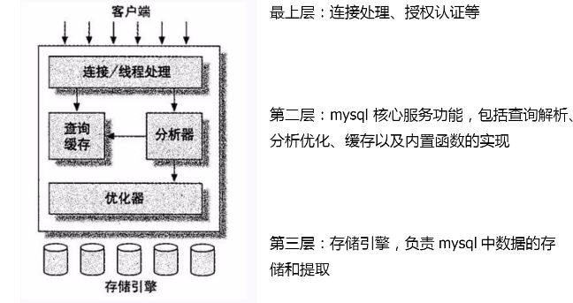

# 会议记录
## 1，数组
1. 数组类型：索引数组，关联数组
2. 初始化：因为php是弱语言类型，所以不要求数组中的每个元素类型相同。 
    例，```$arr=array('one'=>1,'two'=>'a string','three'=>array(...),...); ```
3. 插入：关联数组，```$arr['key']=$value```;索引数组，```$arr[]=$value```,等同于在数组末尾插入一个元素
4. 常用函数：is_array(),count(),sort(),array_merge(),array_push()
5. 数组遍历：
	* ```for($count=0;$count<count($arr);$count++){}```
	* ```foreach($arr as $key => $value){}```

---
##2，面向对象(与java对象类似)
1. 面向对象重点：
	* 属性，成员，实例化
	* 析构，构造函数
	* 继承，封装，访问权限（public， protected，private）
	* ```$this```
2. php对象特异点：
	* php构造函数不支持函数重载，子类调用父类构造函数使用parent::_construct()
	* ```$this```代表本类的实例化，在类的内部调用类的数据成员和方法时都必须使用```this```,即```$this->member, $this->function()```
	* php析构函数同java，c++析构函数一样，很少显示调用
	* php static属性和方法调用时不需要实例化，即```$class::$static member $class::$static function()```若在类内调用static属性和方法则需要使用```self::```。

---
##3，异常处理
1. php异常处理同java，```try{}catch(Exception $e){}finally{}```
2. 可能的异常情况：
	* 资源句柄为空，如打开数据库失败等
	* 不合法操作，如除以零等

---
##4，composer
composer是php管理依赖关系的工具之一，仅作了解，暂时用不到

---
##5，session和cookie
1. 功能：http无状态协议，分别保存客户端和服务器端上下文信息
2. 区别：cookie存储在浏览器客户端，session存储在服务器端，为每个访客分配唯一一个表示会话的id
3. 关系：cookie通过客户端保持状态的解决方案，从http头传递；session依附于cookie的机制，在cookie中携带session_id

---
##6，mysql
1. 引擎类型：innoDB（支持事务），MyISAM（支持全文索引）。常用类型为innoDB，常用字符编码为UTF-8
2. 引擎层次

3. 索引类型:B-TREE(常用),hash
4. 索引使用建议：
	* where字段使用索引
	* 添加索引字段的散列程度尽可能大
	* 不要在列上进行运算
	* 不要设置过多索引
以上都是为了数据库性能考虑
5. mysql常用操作：难点连接查询
	* join连接
	* left join 左连接
	* right join 右连接
6. 注意点：用select查询时尽量不要用*。为了查询效率考虑。
