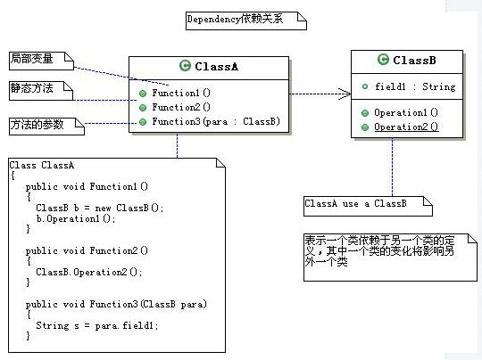
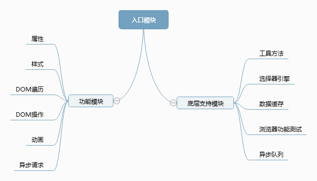

# Web系统概论培训记录（7）

### 主题：初见神奇的jQuery（2015.11.09）

记录人：张言

### Review Part

作业问题回顾：
> 
- **数据过滤**: 永远不要在PHP代码中信任外部输入，要堤防SQL注入和XSS攻击，在使用之前一定要先过滤和验证，可以使用filter_var和filter_input函数可以帮助过滤文本和验证文本格式，使用PDO也可以过滤一些信息
- **加密问题**：比较好的加密方式是在前端数据传到后台之前，js将获取到的数据用MD5来加密，然后传输到后台，php用hash再加密，然后存入到数据库
- **异常捕获**：在可能出错的地方写上异常捕获，将php错误直接反馈给用户是一种很不友好的方式。
- **其他问题**：作业需要提交关于数据库的创建的文件.sql，Navicate软件可以将建数据库的语句导出sql文件。推荐学习php的网站：[php之道](http://wulijun.github.io/php-the-right-way/)

### New Part
主讲：林寿山
推荐：[jQuery官网](http://jquery.com)

### Foundation Part

- **库（library）**:  函数的集合，用于开发的子程序集合，在各种编程语言中或多或少都有，可以解决某一类的问题。
- **框架（framework）**：与库相比，是一个更大的概念，不仅仅是函数库的集合，解决某一领域的问题，如MVC框架
- **API**：应用程序接口，是系统不同组成部分衔接的约定，指的是函数签名 = 函数名 + 参数列表。
- **封装（Encapsulation）**：一种将抽象性函数接口的实现细节部分包装、隐藏起来的方法。
- **依赖（Dependency）**：表示一个库依赖于另一个库的定义，其中底层被依赖的库如果发生变化将影响依赖它的所有库。


以c++为例的依赖关系说明图。
**注意：jQuery版本更新迅速，旧项目维护时候应使用该项目对应的jQuery版本，使用新版本开发新项目时候，尽量不使用deprecated的API。**
----
### Main Part

###### 1. jQuery结构模型

```
（function(window, noGlobal) {
var jQuery = function( selector, context ) {
return new jQuery.fn.init( selector, context );
};
jQuery.fn = jQuery.prototype = {};
// 核心方法
// 回调系统
// 异步队列
// 数据缓存
// 队列操作
// 选择器引
// 属性操作
// 节点遍历
// 文档处理
// 样式操作
// 属性操作
// 事件体系
// AJAX交互
// 动画引擎
return jQuery;
});
```

通过jQuery("selector")给被选元素绑定一个jQuery对象。

##### 2. jQuery API模块划分


各分支使用例子见作业要求看的w3cSchool-jQuery部分。
##### 3. jQuery链式语法

eg: `$('div').attr(color)`返回值仍是一个jQuery对象可以继续调用jQuery的操作，以此类推实现链式语法。

##### 4. jQuery选择器的使用

1. `$('div .left')`表示查找div元素中的class="left"的元素；
2. `$('<p></p>')`表示创建了一个新的包含p元素的jQuery对象，**但是该元素仅存在于内存中，必须手动添加到DOM树才可见**；
3. `$(function(){...})`表示加载完成时调用此函数.
注：以上三种情况为常用方式，不代表全部用法。

##### 5. jQuery对象
`var divlist = $('div')`，divlist是一个jQuery对象，内包含页面上所有div标签的DOM element。jQuery对象是类数组对象，`divlist.length`就可以输出对象个数，divlist[0]可输出第一个对象，以此类推。
