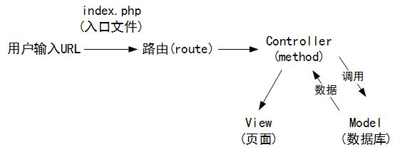

# Web系统概论培训记录（8）

### 主题：jQuery作业点评&PHP框架简介（2015.11.19）

记录人：蔡孝直

---
### Review
**主讲人：林寿山学长**

#### 1. 前端输入数据检查

_**前端的数据永远都是不可信的**_,因此仅在前端进行用户输入数据的检测是不够的,需要在后台php中再次检查，做到双重检查，才能保证用户体验。

#### 2. 代码“坏味道”(有二十多种，以下仅挑选两条常见的“坏味道”举例)

* 过长函数

>参考孔思聪的[jQuery作业](https://github.com/ITEC-ELWG/FE-Study/blob/master/kongsicong/puzzlen/puzzlen.js)。优点：函数命名规范（见名知意、Camel命名法），各函数分工明确；缺点：作业中重置游戏函数过长。

建议将函数写的短小精炼，每个函数控制在十几行左右，每个函数只做一件事情，如此方便找出错误，便于阅读。同时，每个函数拥有一个好名字，可以使代码阅读起来更为方便，无需看函数中具体的代码实现。

* 重复的代码

>参考王睿的[jQuery作业](https://github.com/ITEC-ELWG/FE-Study/blob/master/wangrui/puzzle2.0/puzzle2.0.js)中上下左右移动部分的代码。

代码重复是在写程序时非常忌讳的问题。如果你在一个以上的地点看到相同的程序结构，那么：设法将它们合而为一，程序会变得更好。

代码重复带来的问题是：假如需要改需求，则每段重复的代码都需要修改，不断的复制粘贴会造成修改的遗漏，修改错误等等问题。

代码重复的解决方法是：类似于CSS讲解中，对泛化与特化的理解。将代码中重复的部分与差异的部分分割开，形成一个单独的子函数，通过传入参数的不同，来改变结果。

此外要注意代码的整洁性，否则不便于后期阅读和维护，同时代码混乱会造成团队整体开发效率的降低。

#### 3. 代码重构(Code refactoring)

代码重构：在不改变现有功能的情况下，修改代码，使得代码的结构和逻辑更加清晰。在日常开发中，我们要经常审视自己的代码并重构。重构要时刻考虑，而不要拖到以后。

### PHP框架
**主讲人：刘文哲学长**

#### 1. MVC架构

MVC（Model-View-Controller）由以下部分组成：

- 模型（Model）：程序应用功能的实现，程序逻辑的实现。在PHP中负责与数据的增删查找。
- 视图（View）：图形界面逻辑。在PHP中负责展示输出，处理如何调用模板、需要的资源文件。
- 控制器（Controller）：负责转发请求，对请求处理。在PHP中根据请求决定调用的视图及使用数据。

以上三者的关系图，如下图所示：



#### 2. 用PHP实现一个最简单的MVC框架

最简单的MVC框架的目录结构如下：

```
/*
├─www                       # 网站根目录
│  ├─controller             # 控制器目录
│  │  ├─Controller.php      # 控制器
│  ├─model                  # 模型目录
│  │  ├─model.php           # model模型
│  ├─view                   # 视图目录
│  │  ├─index.php           # index视图
│  ├─index.php              # 入口文件
*/
```

Controller.php

```php
<?php
class ExampleController
{
    public function test ()
    {
        //接受参数
        //调用Model
        //调用View，返回数据
    }
}
?>
```

index.php

```php
<?php
//http://localhost/index.php?c=Example&m=test&p=hello
//以上URL看出，访问的文件是index.php，同时含有三个参数c、m、p。
$controller = $_GET['c'];
$method = $_GET['m'];
$parameter = $_GET['p'];

require_once("controller/$controller.'controller.php'");

$controllerName = controller.'controller.php';
$controllerInstance = new $controllerName();
$controllerInstance->$method();
?>
```

对MVC架构[更加详细的说明](http://www.jb51.net/article/60796.htm)

**常用的框架**：

- 推荐入门级框架：[CodeIgniter](https://www.codeigniter.com/)
- CI框架熟悉后，可学习[yii2](http://www.yiiframework.com/)、[laravel](http://laravel.com/)
- 使用CI框架的一些[注意事项](http://neoyeelf.github.io/2015/03/17/CodeIgniter%E5%AD%A6%E4%B9%A0%E7%AC%94%E8%AE%B0%EF%BC%88%E4%B8%80%EF%BC%89/)
- 使用yii2的一些[注意事项](http://neoyeelf.github.io/2015/07/24/YII%E6%A1%86%E6%9E%B6%E5%AD%A6%E4%B9%A0%E2%80%94%E2%80%94%E6%9C%89%E5%85%B3ActiveRecord%E7%9A%84%E4%B8%80%E4%BA%9B%E5%9D%91/)、[心得](http://neoyeelf.github.io/2015/03/17/CodeIgniter%E5%AD%A6%E4%B9%A0%E7%AC%94%E8%AE%B0%EF%BC%88%E4%BA%8C%EF%BC%89/)

#### 3. PHP开发实践注意事项**

- 一些刘文哲学长在开发过程中总结的[注意事项](http://neoyeelf.github.io/2015/05/11/php%E5%BC%80%E5%8F%91%E5%AE%9E%E8%B7%B5/)
- 模板引擎:模板引擎被广泛应用于页面和PHP的分离，常用的模板引擎[Smarty](http://www.smarty.net/)。
- 重点推荐网站和书籍
    - PHP:《深入php：面向对象、模式与实践》
    - mysql:《高性能mysql》
    - Linux：《鸟哥的Linux私房菜：基础篇》
    - 自学网站：[慕课网](http://www.imooc.com/)
    - 详情查看[php学习推荐书籍和网站](https://github.com/ITEC-ELWG/PHP-study/blob/master/php%E5%AD%A6%E4%B9%A0%E6%8E%A8%E8%8D%90%E4%B9%A6%E7%B1%8D%E5%92%8C%E7%BD%91%E7%AB%99.md)
